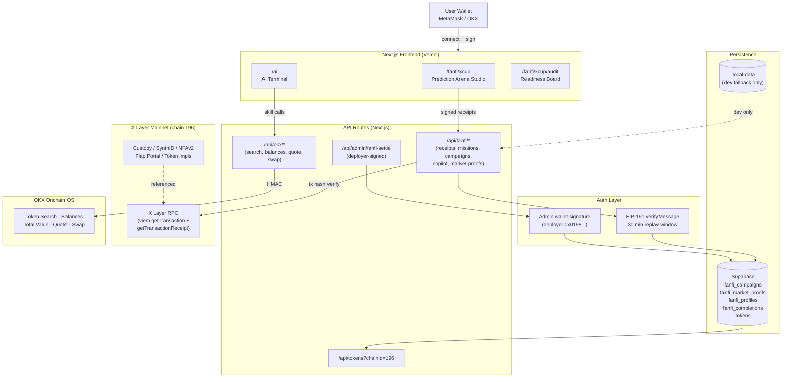
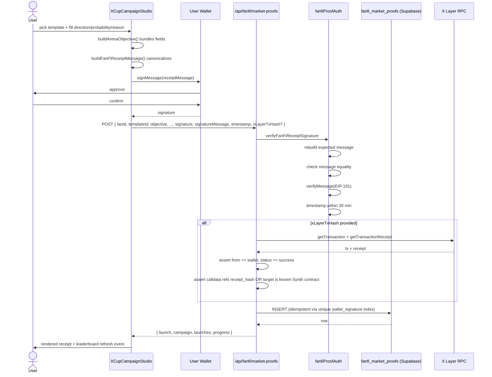
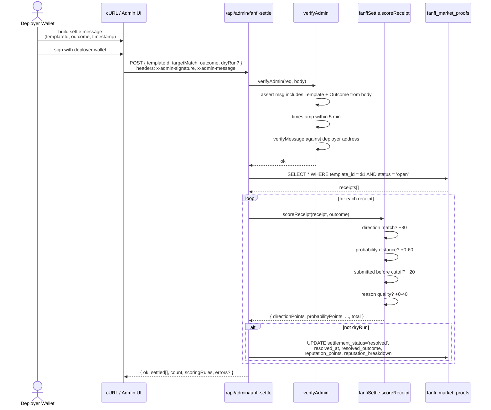

# SynthLaunch Architecture

This document covers the system architecture for both **SynthLaunch core** (agent-native token launch + Onchain OS terminal) and **Synth SportFi Arena** (the X Cup prediction-receipt branch built on top).

---

## System Overview



---

## SportFi Prediction Arena: Data Flow

### 1. Submit a Signed Receipt



**Key invariants enforced:**
- Signature must match a server-reconstructed canonical message (any mutation breaks verification).
- Timestamp must be within 30 min (replay protection).
- Idempotency: `wallet_signature` is a unique index in Supabase. Replaying the same signed receipt returns the existing row, not a duplicate.
- X Layer tx (when provided) is independently verified via RPC: the tx must have been sent **by** the submitting wallet, must be successful, and must either reference the receipt hash in its calldata or target a known SynthLaunch X Layer contract.

### 2. Resolve an Arena (Settlement)



**Why this is admin-only:** Settlement is a write-amplification operation (one call can update many receipts). The signature requirement prevents anyone from forging a "resolved" state. The admin signature also binds to the specific (templateId, outcome) combination — so signing one settle and trying to replay it as a different settle is rejected.

---

## Persistence Layer

```
                     ┌────────────────────────────────┐
                     │       Application Layer        │
                     │   src/lib/localFanfi*Store.ts  │
                     │   ─ getFanFi*                  │
                     │   ─ upsertFanFi*               │
                     │   ─ createFanFiMarketProof     │
                     └──────────────┬─────────────────┘
                                    │
                  isSupabaseConfigured() ?
                                    │
                       ┌────────────┴────────────┐
                       │                         │
                       ▼                         ▼
            ┌──────────────────────┐  ┌──────────────────────┐
            │      Supabase        │  │   .local-data/       │
            │ (production / staging│  │   (dev only)         │
            │  / preview)          │  │                      │
            │                      │  │  fanfi-*.json files  │
            │  fanfi_campaigns     │  │                      │
            │  fanfi_market_proofs │  │                      │
            │  fanfi_profiles      │  │                      │
            │  fanfi_completions   │  │                      │
            └──────────────────────┘  └──────────────────────┘
```

**Migration**: [`supabase/migrations/009_fanfi_tables.sql`](supabase/migrations/009_fanfi_tables.sql)

**Fallback rule**: Every store function calls `isSupabaseConfigured()` (true iff `NEXT_PUBLIC_SUPABASE_URL` and `SUPABASE_SERVICE_ROLE_KEY` / `SUPABASE_SERVICE_KEY` are both present). When true, all reads and writes go to Supabase. When false (rare in production, common in local dev), the same calls fall back to JSON files under `.local-data/` (or `/tmp/synthlaunch/` in production with `DISABLE_LOCAL_FANFI_STORE` not set, but production is expected to have Supabase configured).

The fallback exists so developers can run the full FanFi flow locally without Supabase. It is not intended for production.

---

## OKX Onchain OS Integration

Five skills are wired into the application:

| Skill | OKX Endpoint | App Route | UI surface |
|---|---|---|---|
| Token Search | `/api/v6/dex/market/token/search` | `/api/okx/token-search` | `XCupTradingProofPanel`, AI Terminal |
| Balances | `/api/v6/dex/balance/all-token-balances-by-address` | `/api/okx/balances` | `XCupTradingProofPanel`, AI Terminal |
| Total Value | `/api/v6/dex/balance/total-value-by-address` | `/api/okx/balances` (combined) | `XCupTradingProofPanel`, AI Terminal |
| Quote | `/api/v6/dex/aggregator/quote` | `/api/okx/quote` | `XCupTradingProofPanel`, AI Terminal |
| Swap | `/api/v6/dex/aggregator/swap` | `/api/okx/swap` | AI Terminal (signed by user wallet) |

**HMAC signing** lives in [`src/lib/okx.ts`](src/lib/okx.ts). The API key, secret, passphrase, and project ID are server-side environment variables and never leave the Next.js server.

**Non-custodial swap execution**: the swap aggregator returns an unsigned transaction. The frontend asks the user's wallet to sign it. The app never holds a private key.

---

## Key Files (SportFi branch)

| Path | Purpose |
|---|---|
| `src/app/fanfi/xcup/page.tsx` | Arena landing route |
| `src/app/fanfi/xcup/audit/page.tsx` | Readiness board |
| `src/components/fanfi/XCupFanFiPageContent.tsx` | Hero, countdown, sample arena board, story sections |
| `src/components/fanfi/XCupCampaignStudio.tsx` | Create / save / sign prediction receipts |
| `src/components/fanfi/XCupLivePanel.tsx` | Live X Layer asset feed + leaderboard (filters FanFi receipts from market cap aggregate) |
| `src/components/fanfi/XCupSettlementPanel.tsx` | Live settlement stats + scoring rules + receipt schema |
| `src/components/fanfi/XCupMissionsPanel.tsx` | Mission tracker with per-mission EIP-191 signatures |
| `src/components/fanfi/XCupTradingProofPanel.tsx` | OKX Onchain OS skill panel |
| `src/lib/fanfiCampaigns.ts` | Template registry (5 X Cup presets) |
| `src/lib/fanfiCopilot.ts` | Deterministic AI persona / mission / launch pack generator |
| `src/lib/fanfiMissions.ts` | Mission registry |
| `src/lib/fanfiProofSignature.ts` | Canonical EIP-191 message builders (3 contexts: receipt, mission, campaign) |
| `src/lib/fanfiProofAuth.ts` | Server-side signature verification + replay guard |
| `src/lib/fanfiSettle.ts` | Reputation scoring engine (+80/+0-60/+20/+0-40) |
| `src/lib/localFanfiStore.ts` | Profile + completion + leaderboard store (Supabase or local) |
| `src/lib/localFanfiCampaignStore.ts` | Campaign draft store (Supabase or local) |
| `src/lib/localFanfiMarketProofStore.ts` | Market proof store + X Layer tx verification (Supabase or local) |
| `src/app/api/fanfi/*` | 9 REST endpoints |
| `src/app/api/admin/fanfi-settle/route.ts` | Settlement endpoint |
| `supabase/migrations/009_fanfi_tables.sql` | Persistence schema |
| `SECURITY.md` | Threat model |

---

## Build / Deploy

- **Framework**: Next.js 14 (App Router)
- **Web3**: wagmi v2 + viem
- **Auth**: EIP-191 (`personal_sign`)
- **Persistence**: Supabase (Postgres) + `@supabase/supabase-js`
- **Hosting**: Vercel auto-preview per branch
- **Chain**: X Layer (chain ID 196), BSC (chain ID 56) supported
- **TypeScript**: strict mode; build is `npm run build`, type check is `npx tsc --noEmit`

**Vercel auto-preview**: Every push to the `codex/fanfi-xcup-sportfi` branch triggers a Preview deployment. The Preview URL stays stable (the `*-git-codex-fanfi-xcup-sportfi-*.vercel.app` alias) across re-deploys.
